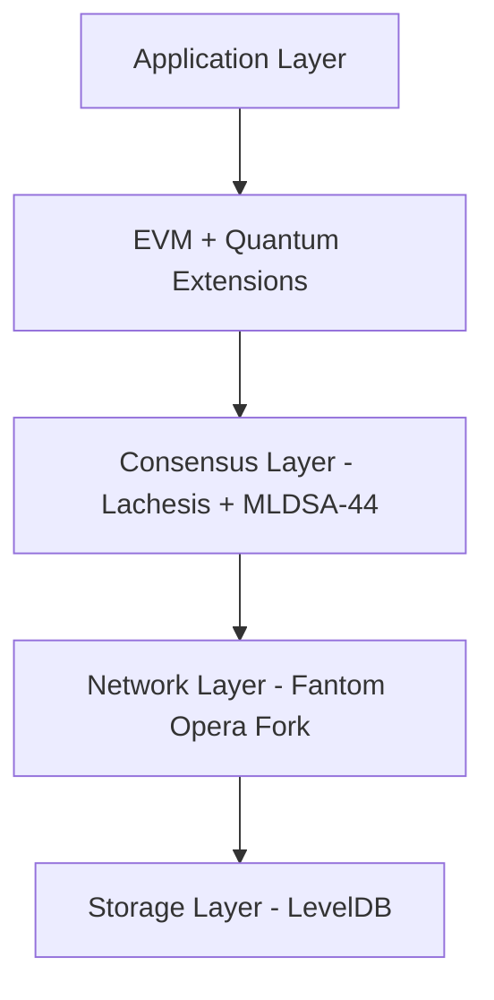

# ARMchain Developer Documentation

Welcome to the ARMchain Developer Hub - your comprehensive guide to building on the world's first quantum-resistant blockchain platform. ARMchain is built on a highly optimized fork of Fantom's Opera network, enhanced with NIST-approved MLDSA-44 (ML-DSA-44) quantum-resistant digital signatures.

## Table of Contents

- [Overview](#overview)
- [Architecture](#architecture)
- [Quick Start](#quick-start)
- [Core APIs](#core-apis)
- [Smart Contracts](#smart-contracts)
- [Quantum-Resistant Features](#quantum-resistant-features)
- [SDK Documentation](#sdk-documentation)
- [Development Tools](#development-tools)
- [Migration from Fantom](#migration-from-fantom)
- [Best Practices](#best-practices)
- [Testing & Debugging](#testing--debugging)
- [Performance Optimization](#performance-optimization)
- [Security Guidelines](#security-guidelines)
- [Support & Community](#support--community)

---

## Overview

ARMchain represents the evolution of blockchain technology for the post-quantum era. Built upon Fantom's proven high-performance architecture, ARMchain integrates cutting-edge quantum-resistant cryptography to ensure your applications remain secure against both classical and quantum computing threats.

### Key Features

- **Fantom Fork**: Built on Fantom's battle-tested Opera consensus mechanism
- **Quantum Resistance**: NIST-approved MLDSA-44 digital signature scheme
- **High Performance**: 50,000+ TPS with sub-second finality
- **EVM Compatibility**: Seamless migration from Ethereum and Fantom
- **Developer Friendly**: Comprehensive tooling and documentation
- **Future-Proof Security**: Protection against quantum computing threats

### Network Specifications

| Parameter | Testnet | Mainnet |
|-----------|---------|---------|
| **Network Name** | ARMchain Testnet | ARMchain Mainnet |
| **Chain ID** | 1001 | 1000 |
| **RPC URL** | https://testnet-rpc.armchain.io | https://rpc.armchain.io |
| **Explorer** | https://testnet-explorer.armchain.io | https://explorer.armchain.io |
| **Currency** | ARM | ARM |
| **Block Time** | 1-2 seconds | 1-2 seconds |
| **Finality** | Instant | Instant |

---

## Architecture

### Core Components

ARMchain's architecture builds upon Fantom's Lachesis consensus with quantum-resistant enhancements:



#### Consensus Mechanism
- **Base**: Fantom's Lachesis aBFT consensus
- **Enhancement**: MLDSA-44 signature verification in consensus
- **Finality**: Instant transaction finality
- **Throughput**: 50,000+ transactions per second

#### Quantum-Resistant Layer
```javascript
// MLDSA-44 signature verification integrated at consensus level
class QuantumConsensus extends LachesisConsensus {
  verifySignature(transaction) {
    // Classical ECDSA verification for backward compatibility
    if (transaction.signatureType === 'ECDSA') {
      return super.verifyECDSA(transaction);
    }

    // Quantum-resistant MLDSA-44 verification
    if (transaction.signatureType === 'MLDSA44') {
      return this.verifyMLDSA44(transaction);
    }

    return false;
  }
}
```

### Network Topology

ARMchain maintains Fantom's efficient network structure while adding quantum-resistant node communication:

```javascript
// Node configuration with quantum-resistant features
const nodeConfig = {
  // Fantom compatibility
  networkId: 1000,
  chainId: 1000,
  consensus: 'lachesis',

  // Quantum enhancements
  quantumSignatures: true,
  mldsa44: {
    enabled: true,
    keySize: 1312,    // MLDSA-44 public key size
    sigSize: 2420     // MLDSA-44 signature size
  },

  // Performance settings
  maxTxPerSecond: 50000,
  blockTime: 1000, // 1 second
  finalityTime: 0  // Instant finality
};
```

---

## Quick Start

### Prerequisites

```bash
# System requirements
Node.js >= 18.0.0
Git
Docker (optional)

# Install ARMchain development tools
npm install -g @armchain/cli @armchain/hardhat-plugin
```

### Development Environment Setup

```bash
# Create new ARMchain project
armchain create my-quantum-dapp
cd my-quantum-dapp

# Install dependencies
npm install

# Initialize with quantum features
armchain init --quantum --template defi

# Start local development node (Fantom fork with MLDSA-44)
armchain node start --dev
```

### First Quantum Transaction

```javascript
import { ARMWallet, QuantumSigner } from '@armchain/sdk';

async function sendQuantumTransaction() {
  // Create quantum-resistant wallet
  const quantumWallet = new ARMWallet({
    privateKey: process.env.PRIVATE_KEY,
    signerType: 'MLDSA44', // Use quantum-resistant signatures
    network: 'testnet'
  });

  // Send transaction with quantum signature
  const tx = await quantumWallet.sendTransaction({
    to: '0x742d35Cc6634C0532925a3b8D29c2Ac1d32c5ecE',
    value: ethers.utils.parseEther('1.0'),
    quantumSafe: true // Force MLDSA-44 signature
  });

  console.log('Quantum-safe transaction:', tx.hash);
  return tx;
}
```

---

## Core APIs

### Blockchain API

ARMchain's API is fully compatible with Fantom's Opera API with quantum extensions.

**Base URLs:**
- Testnet: `https://api-testnet.armchain.io/v1`
- Mainnet: `https://api.armchain.io/v1`

#### Block Information

```http
GET /blocks/{blockNumber}
```

**Enhanced Response with Quantum Data:**
```json
{
  "number": "0x3039",
  "hash": "0x8f4b7c6d9e2a1f5b3c8e7d9f2a4b6c8e1d3f7a9b2c5e8d1f4a7b9c2e5d8f1a4b7c",
  "timestamp": "0x61f4d4a0",
  "parentHash": "0x7f3b6c5d8e1a0f4b2c7e6d8f1a3b5c7e0d2f6a8b1c4e7d0f3a6b8c1e4d7f0a3b6c",
  "gasUsed": "0x5208",
  "gasLimit": "0x7a1200",
  "transactions": [...],

  // Quantum-specific fields
  "quantumSignatures": 42,
  "classicalSignatures": 158,
  "quantumSecurityLevel": "128-bit",
  "mldsa44Verified": true,
  "validator": {
    "address": "0x...",
    "quantumPublicKey": "0x...", // MLDSA-44 public key
    "signatureType": "MLDSA44"
  }
}
```

#### Transaction Details

```http
GET /transactions/{txHash}
```

**Response:**
```json
{
  "hash": "0x...",
  "from": "0x...",
  "to": "0x...",
  "value": "0xde0b6b3a7640000",
  "gasPrice": "0x4a817c800",
  "gasUsed": "0x5208",
  "nonce": "0x1",
  "blockNumber": "0x3039",

  // Quantum signature information
  "signatureType": "MLDSA44",
  "quantumSafe": true,
  "mldsa44Signature": {
    "r": "0x...", // Part of MLDSA-44 signature
    "s": "0x...", // Part of MLDSA-44 signature
    "publicKey": "0x...", // MLDSA-44 public key (1312 bytes)
    "verified": true
  },

  // Backward compatibility
  "ecdsaCompatible": true
}
```

#### Quantum Status Endpoint

```http
GET /quantum/status
```

```json
{
  "quantumReadiness": {
    "mldsa44Support": true,
    "quantumSignaturePercentage": 23.5,
    "averageQuantumTxPerBlock": 42,
    "quantumValidators": 85,
    "totalValidators": 100
  },
  "networkSecurity": {
    "classicalSecurityLevel": "128-bit",
    "quantumSecurityLevel": "128-bit",
    "hybridModeActive": true
  }
}
```

### Wallet API

Enhanced wallet functionality with quantum-resistant features:

#### Create Quantum Transaction

```javascript
import { ARMProvider, QuantumWallet } from '@armchain/sdk';

const provider = new ARMProvider('https://testnet-rpc.armchain.io');

// Create quantum-resistant wallet
const wallet = new QuantumWallet({
  provider,
  signatureType: 'MLDSA44'
});

// Generate quantum-safe key pair
const keyPair = await wallet.generateQuantumKeyPair();
console.log('Public Key (MLDSA-44):', keyPair.publicKey);
console.log('Private Key Size:', keyPair.privateKey.length);

// Create quantum-safe transaction
const tx = await wallet.createTransaction({
  to: recipient,
  value: amount,
  quantumProof: {
    enabled: true,
    algorithm: 'MLDSA44',
    securityLevel: 128
  }
});

// Sign with quantum-resistant algorithm
const signedTx = await wallet.signQuantumTransaction(tx);
```

#### Hybrid Signature Support

```javascript
// Support both classical and quantum signatures
class HybridWallet extends ARMWallet {
  constructor(options) {
    super(options);
    this.quantumSigner = new MLDSA44Signer();
    this.classicalSigner = new ECDSASigner();
  }

  async signTransaction(tx, options = {}) {
    const { forceQuantum = false, forceClassical = false } = options;

    if (forceQuantum || this.preferQuantum) {
      return await this.quantumSigner.sign(tx);
    }

    if (forceClassical) {
      return await this.classicalSigner.sign(tx);
    }

    // Hybrid mode: use quantum for high-value transactions
    const value = ethers.BigNumber.from(tx.value || 0);
    const threshold = ethers.utils.parseEther('100'); // 100 ARM threshold

    if (value.gte(threshold)) {
      return await this.quantumSigner.sign(tx);
    } else {
      return await this.classicalSigner.sign(tx);
    }
  }
}
```

---

## Smart Contracts

ARMchain maintains full EVM compatibility while adding quantum-resistant features accessible through precompiles and enhanced opcodes.

### Quantum-Resistant Contract Development

#### Basic Quantum-Safe Token

```solidity
// SPDX-License-Identifier: MIT
pragma solidity ^0.8.19;

import "@armchain/contracts/quantum/IMLDSA44Verifier.sol";
import "@armchain/contracts/security/QuantumReentrancyGuard.sol";

contract QuantumSafeToken is QuantumReentrancyGuard {
    mapping(address => uint256) private _balances;
    mapping(address => mapping(address => uint256)) private _allowances;
    mapping(address => bytes) private _quantumPublicKeys;

    string public name = "Quantum Safe Token";
    string public symbol = "QST";
    uint8 public decimals = 18;
    uint256 public totalSupply = 1000000 * 10**18;

    // ARMchain quantum verifier precompile
    IMLDSA44Verifier constant QUANTUM_VERIFIER = IMLDSA44Verifier(0x0000000000000000000000000000000000001001);

    event Transfer(address indexed from, address indexed to, uint256 value);
    event QuantumSignatureRegistered(address indexed account, bytes publicKey);
    event QuantumTransfer(address indexed from, address indexed to, uint256 value, bytes quantumProof);

    constructor() {
        _balances[msg.sender] = totalSupply;
    }

    // Register quantum public key for an account
    function registerQuantumKey(bytes calldata publicKey) external {
        require(publicKey.length == 1312, "Invalid MLDSA-44 public key length");
        _quantumPublicKeys[msg.sender] = publicKey;
        emit QuantumSignatureRegistered(msg.sender, publicKey);
    }

    // Quantum-safe transfer with MLDSA-44 verification
    function quantumTransfer(
        address to,
        uint256 amount,
        bytes calldata quantumSignature,
        bytes32 messageHash
    ) external nonReentrant {
        require(to != address(0), "Transfer to zero address");
        require(_balances[msg.sender] >= amount, "Insufficient balance");
        require(_quantumPublicKeys[msg.sender].length > 0, "Quantum key not registered");

        // Verify quantum signature using precompile
        bool isValid = QUANTUM_VERIFIER.verifyMLDSA44(
            messageHash,
            quantumSignature,
            _quantumPublicKeys[msg.sender]
        );
        require(isValid, "Invalid quantum signature");

        _balances[msg.sender] -= amount;
        _balances[to] += amount;

        emit Transfer(msg.sender, to, amount);
        emit QuantumTransfer(msg.sender, to, amount, quantumSignature);
    }

    // Backward compatible classical transfer
    function transfer(address to, uint256 amount) external returns (bool) {
        require(to != address(0), "Transfer to zero address");
        require(_balances[msg.sender] >= amount, "Insufficient balance");

        _balances[msg.sender] -= amount;
        _balances[to] += amount;

        emit Transfer(msg.sender, to, amount);
        return true;
    }

    function balanceOf(address account) external view returns (uint256) {
        return _balances[account];
    }

    function getQuantumPublicKey(address account) external view returns (bytes memory) {
        return _quantumPublicKeys[account];
    }
}
```

#### Advanced DeFi with Quantum Security

```solidity
pragma solidity ^0.8.19;

import "@armchain/contracts/defi/QuantumAMM.sol";
import "@armchain/contracts/oracles/QuantumPriceOracle.sol";

contract QuantumDEX is QuantumAMM {
    using SafeMath for uint256;

    struct QuantumLiquidityPool {
        address tokenA;
        address tokenB;
        uint256 reserveA;
        uint256 reserveB;
        uint256 quantumSecurityDeposit; // Additional security for quantum-verified LPs
        mapping(address => bytes) lpQuantumKeys;
    }

    mapping(bytes32 => QuantumLiquidityPool) public pools;
    QuantumPriceOracle public priceOracle;

    event QuantumSwap(
        address indexed user,
        address indexed tokenIn,
        address indexed tokenOut,
        uint256 amountIn,
        uint256 amountOut,
        bytes quantumProof
    );

    // Quantum-verified swap with enhanced security
    function quantumSwap(
        address tokenIn,
        address tokenOut,
        uint256 amountIn,
        uint256 minAmountOut,
        bytes calldata quantumSignature,
        bytes32 swapHash
    ) external {
        bytes32 poolId = keccak256(abi.encodePacked(tokenIn, tokenOut));
        QuantumLiquidityPool storage pool = pools[poolId];

        // Verify quantum signature
        require(
            QUANTUM_VERIFIER.verifyMLDSA44(
                swapHash,
                quantumSignature,
                getUserQuantumKey(msg.sender)
            ),
            "Invalid quantum signature"
        );

        // Get quantum-verified price
        uint256 quantumPrice = priceOracle.getQuantumVerifiedPrice(tokenIn, tokenOut);

        // Calculate swap amount with quantum price verification
        uint256 amountOut = calculateSwapAmount(
            amountIn,
            pool.reserveA,
            pool.reserveB,
            quantumPrice
        );

        require(amountOut >= minAmountOut, "Insufficient output amount");

        // Execute quantum-safe swap
        _executeQuantumSwap(tokenIn, tokenOut, amountIn, amountOut);

        emit QuantumSwap(msg.sender, tokenIn, tokenOut, amountIn, amountOut, quantumSignature);
    }
}
```

### Quantum Precompiles

ARMchain provides built-in quantum cryptographic functions through precompiled contracts:

```solidity
// Available quantum precompiles
address constant MLDSA44_VERIFIER = 0x0000000000000000000000000000000000001001;
address constant KYBER_KEM = 0x0000000000000000000000000000000000001002;
address constant SPHINCS_PLUS = 0x0000000000000000000000000000000000001003;
address constant QUANTUM_RANDOM = 0x0000000000000000000000000000000000001004;

contract QuantumPrecompileExample {
    // Verify MLDSA-44 signature
    function verifyQuantumSignature(
        bytes32 messageHash,
        bytes calldata signature,
        bytes calldata publicKey
    ) public view returns (bool) {
        (bool success, bytes memory result) = MLDSA44_VERIFIER.staticcall(
            abi.encode(messageHash, signature, publicKey)
        );
        return success && abi.decode(result, (bool));
    }

    // Generate quantum-safe random number
    function getQuantumRandom() public view returns (bytes32) {
        (bool success, bytes memory result) = QUANTUM_RANDOM.staticcall("");
        require(success, "Quantum random generation failed");
        return abi.decode(result, (bytes32));
    }
}
```

---

## Quantum-Resistant Features

### MLDSA-44 Integration

ARMchain implements NIST's ML-DSA-44 (Module Lattice Digital Signature Algorithm) for quantum-resistant digital signatures.

#### Key Characteristics

```javascript
const MLDSA44_SPECS = {
  // Security level
  securityLevel: 128, // bits
  quantumSecurityLevel: 128, // bits

  // Key sizes (bytes)
  publicKeySize: 1312,
  privateKeySize: 2560,
  signatureSize: 2420,

  // Performance
  keyGenTime: '~1ms',
  signTime: '~0.8ms',
  verifyTime: '~0.7ms',

  // NIST standardization
  nistStatus: 'Approved',
  standardDocument: 'FIPS 204'
};
```

#### Implementation Architecture

```javascript
class MLDSA44Implementation {
  constructor() {
    // Parameters for ML-DSA-44
    this.n = 256;        // Ring dimension
    this.k = 4;          // Matrix height
    this.l = 4;          // Matrix width
    this.eta = 2;        // Secret key bound
    this.tau = 39;       // Number of ±1's in challenge
    this.beta = 78;      // Rejection bound
    this.gamma1 = 2**17; // Masking bound
    this.gamma2 = (this.q - 1) / 88; // Low-order bound
    this.omega = 80;     // Maximum weight of hint
  }

  // Key generation
  async generateKeyPair() {
    const seed = await this.generateRandomSeed(32);
    const { publicKey, privateKey } = await this.keyGen(seed);

    return {
      publicKey: new Uint8Array(publicKey),
      privateKey: new Uint8Array(privateKey),
      algorithm: 'ML-DSA-44'
    };
  }

  // Digital signature
  async sign(message, privateKey) {
    const messageHash = this.hash(message);
    const signature = await this.signInternal(messageHash, privateKey);

    return {
      signature: new Uint8Array(signature),
      size: 2420,
      algorithm: 'ML-DSA-44'
    };
  }

  // Signature verification
  async verify(message, signature, publicKey) {
    const messageHash = this.hash(message);
    return await this.verifyInternal(messageHash, signature, publicKey);
  }
}
```

### Quantum-Safe Wallet Generation

```javascript
import { QuantumWallet, MLDSA44KeyGenerator } from '@armchain/quantum';

class QuantumARMWallet {
  constructor() {
    this.keyGenerator = new MLDSA44KeyGenerator();
    this.classicalKeyGen = new ECDSAKeyGenerator();
  }

  async generateHybridWallet() {
    // Generate classical ECDSA keys (for compatibility)
    const classicalKeys = await this.classicalKeyGen.generate();

    // Generate quantum-resistant MLDSA-44 keys
    const quantumKeys = await this.keyGenerator.generate();

    // Create hybrid wallet
    const wallet = new QuantumWallet({
      address: classicalKeys.address, // Use ECDSA address for compatibility
      classicalPrivateKey: classicalKeys.privateKey,
      classicalPublicKey: classicalKeys.publicKey,
      quantumPrivateKey: quantumKeys.privateKey,
      quantumPublicKey: quantumKeys.publicKey,

      // Wallet configuration
      defaultSignatureType: 'HYBRID', // Automatically choose based on context
      quantumThreshold: ethers.utils.parseEther('10') // Use quantum for >10 ARM
    });

    return wallet;
  }

  async signTransaction(transaction, options = {}) {
    const { forceQuantum = false } = options;

    if (forceQuantum || this.shouldUseQuantumSignature(transaction)) {
      return await this.signWithMLDSA44(transaction);
    } else {
      return await this.signWithECDSA(transaction);
    }
  }

  shouldUseQuantumSignature(transaction) {
    // Use quantum signatures for:
    // 1. High-value transactions
    // 2. Smart contract interactions
    // 3. User preference

    const value = ethers.BigNumber.from(transaction.value || 0);
    const isHighValue = value.gte(this.quantumThreshold);
    const isContractInteraction = transaction.to && transaction.data !== '0x';

    return isHighValue || isContractInteraction || this.preferQuantum;
  }
}
```

### Quantum-Resistant Node Operation

```javascript
// Enhanced validator node with quantum capabilities
class QuantumValidator extends FantomValidator {
  constructor(config) {
    super(config);
    this.quantumSigner = new MLDSA44Signer();
    this.quantumVerifier = new MLDSA44Verifier();
  }

  async validateBlock(block) {
    // Standard Fantom validation
    const classicalValidation = await super.validateBlock(block);
    if (!classicalValidation.valid) return classicalValidation;

    // Additional quantum signature validation
    const quantumValidation = await this.validateQuantumSignatures(block);

    return {
      valid: quantumValidation.valid,
      classicalChecks: classicalValidation,
      quantumChecks: quantumValidation
    };
  }

  async validateQuantumSignatures(block) {
    let validQuantumSignatures = 0;
    let totalQuantumSignatures = 0;

    for (const tx of block.transactions) {
      if (tx.signatureType === 'MLDSA44') {
        totalQuantumSignatures++;

        const isValid = await this.quantumVerifier.verify(
          tx.hash,
          tx.signature,
          tx.senderQuantumPublicKey
        );

        if (isValid) validQuantumSignatures++;
      }
    }

    return {
      valid: validQuantumSignatures === totalQuantumSignatures,
      quantumSignatures: totalQuantumSignatures,
      validQuantumSignatures,
      quantumSecurityLevel: totalQuantumSignatures > 0 ? 128 : 0
    };
  }
}
```

---

## SDK Documentation

The ARMchain SDK extends Fantom's functionality with quantum-resistant features.

### Installation and Setup

```bash
npm install @armchain/sdk @armchain/quantum
```

### Core SDK Features

```javascript
import {
  ARMProvider,
  QuantumWallet,
  ContractFactory,
  utils
} from '@armchain/sdk';

// Initialize provider with quantum features
const provider = new ARMProvider({
  url: 'https://testnet-rpc.armchain.io',
  quantumSupport: true,
  network: {
    name: 'ARMchain Testnet',
    chainId: 1001,
    fantomCompatible: true
  }
});

// Create quantum-enhanced wallet
const wallet = new QuantumWallet({
  provider,
  mnemonic: 'your twelve word mnemonic phrase here',
  quantumEnabled: true
});
```

### Advanced SDK Usage

#### Multi-Signature Quantum Wallet

```javascript
import { QuantumMultiSigWallet } from '@armchain/sdk';

const multiSigWallet = new QuantumMultiSigWallet({
  signers: [
    { address: '0x...', type: 'ECDSA' },
    { address: '0x...', type: 'MLDSA44' },
    { address: '0x...', type: 'HYBRID' }
  ],
  threshold: 2,
  quantumRequirement: 1 // At least 1 quantum signature required
});

// Create multi-sig transaction
const tx = await multiSigWallet.createTransaction({
  to: recipient,
  value: amount,
  requireQuantum: true
});

// Sign with quantum signature
const quantumSignature = await wallet.signWithMLDSA44(tx);
await multiSigWallet.addSignature(tx.id, quantumSignature);
```

#### Contract Interaction with Quantum Features

```javascript
import { QuantumContract } from '@armchain/sdk';

const contract = new QuantumContract({
  address: contractAddress,
  abi: contractABI,
  wallet: quantumWallet,
  quantumMethods: ['quantumTransfer', 'verifyQuantumProof'] // Methods requiring quantum signatures
});

// Automatically uses quantum signature for quantum methods
const tx = await contract.quantumTransfer(
  recipient,
  amount,
  { quantumProof: true }
);
```

#### Event Monitoring with Quantum Data

```javascript
// Monitor quantum-specific events
const filter = {
  address: contractAddress,
  topics: [
    utils.id('QuantumTransfer(address,address,uint256,bytes)')
  ]
};

provider.on(filter, (log) => {
  const decoded = contract.interface.parseLog(log);
  console.log('Quantum Transfer:', {
    from: decoded.args.from,
    to: decoded.args.to,
    amount: decoded.args.amount.toString(),
    quantumProof: decoded.args.quantumProof,
    blockNumber: log.blockNumber
  });
});
```

---

## Development Tools

### Enhanced ARMchain CLI

The ARMchain CLI extends Fantom's tooling with quantum-specific commands:

```bash
# Standard commands (Fantom compatible)
armchain init my-project
armchain compile
armchain deploy --network testnet

# Quantum-specific commands
armchain quantum keygen --algorithm mldsa44
armchain quantum verify-signature --signature <sig> --pubkey <key> --message <msg>
armchain quantum contract-deploy --quantum-required
armchain quantum wallet create --hybrid
armchain quantum validator setup --quantum-keys

# Network analysis
armchain quantum network-status
armchain quantum security-report
armchain quantum migration-check --from fantom
```

### Development Configuration

```javascript
// armchain.config.js
module.exports = {
  networks: {
    testnet: {
      url: 'https://testnet-rpc.armchain.io',
      chainId: 1001,
      accounts: process.env.PRIVATE_KEYS?.split(','),
      quantum: {
        enabled: true,
        defaultSignatureType: 'HYBRID',
        mldsa44: {
          keySize: 1312,
          signatureSize: 2420
        }
      },
      // Fantom compatibility
      fantomCompatible: true,
      gasPrice: 20000000000, // 20 gwei
      gasLimit: 8000000
    }
  },

  solidity: {
    version: '0.8.19',
    settings: {
      optimizer: {
        enabled: true,
        runs: 200
      }
    }
  },

  quantum: {
    compiler: {
      version: '1.0.0',
      settings: {
        precompileOptimization: true,
        quantumGasOptimization: true
      }
    },
    testing: {
      quantumSimulation: true,
      hybridTesting: true
    }
  }
};
```

### Testing Framework

```javascript
import { ARMTest, QuantumTestUtils } from '@armchain/testing';

describe('Quantum Safe Contract', () => {
  let contract, quantumWallet, classicalWallet;

  beforeEach(async () => {
    // Deploy with quantum testing environment
    const testEnv = await ARMTest.createQuantumEnvironment();

    quantumWallet = await testEnv.createQuantumWallet();
    classicalWallet = await testEnv.createClassicalWallet();

    contract = await testEnv.deployContract('QuantumSafeToken', {
      quantum: true
    });
  });

  it('should handle quantum signatures', async () => {
    // Register quantum public key
    await contract.connect(quantumWallet).registerQuantumKey(
      quantumWallet.quantumPublicKey
    );

    // Create quantum-signed transaction
    const tx = await contract.populateTransaction.quantumTransfer(
      classicalWallet.address,
      ethers.utils.parseEther('100')
    );

    const signedTx = await quantumWallet.signQuantumTransaction(tx);

    // Verify quantum signature verification
    const receipt = await signedTx.wait();
    expect(receipt

## Support

- **Documentation:** [docs.armchain.io](https://docs.armchain.io)
- **GitHub:** [github.com/armchain](https://github.com/armchain)
- **Discord:** [discord.gg/armchain](https://discord.gg/armchain)
- **Stack Overflow:** Tag with `armchain`
